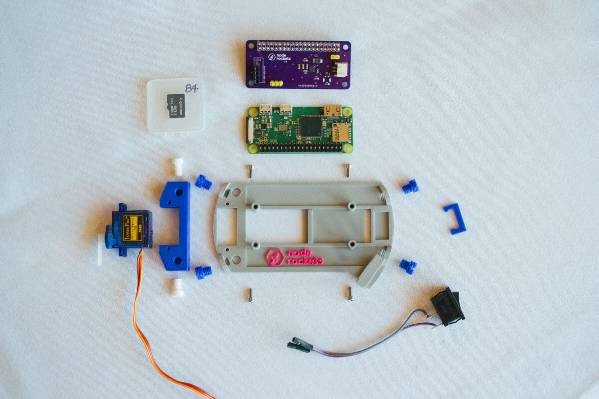
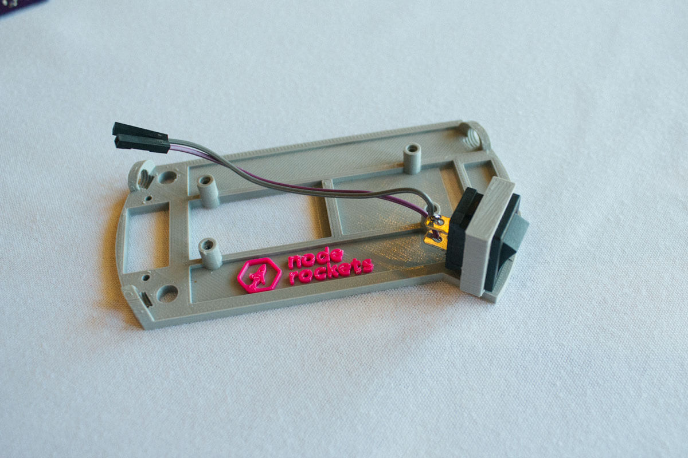
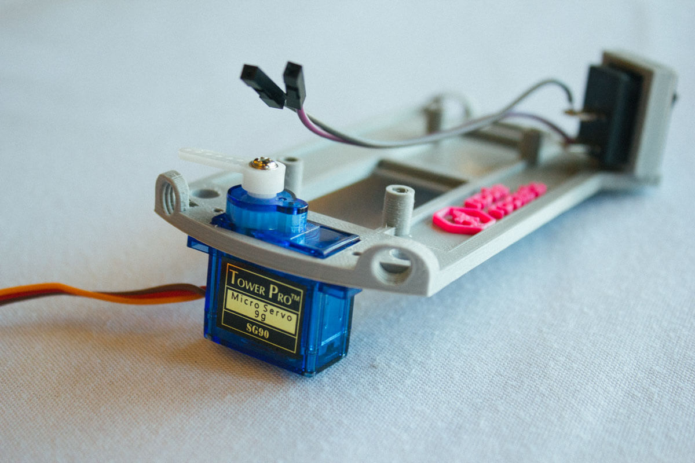
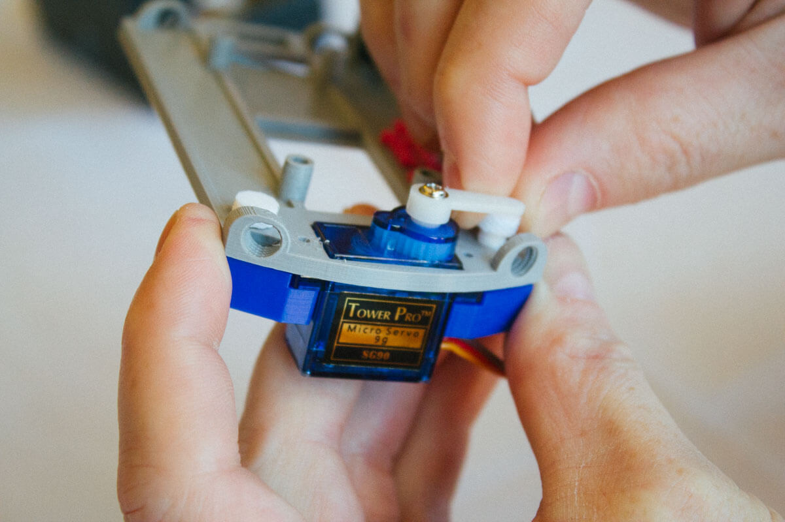
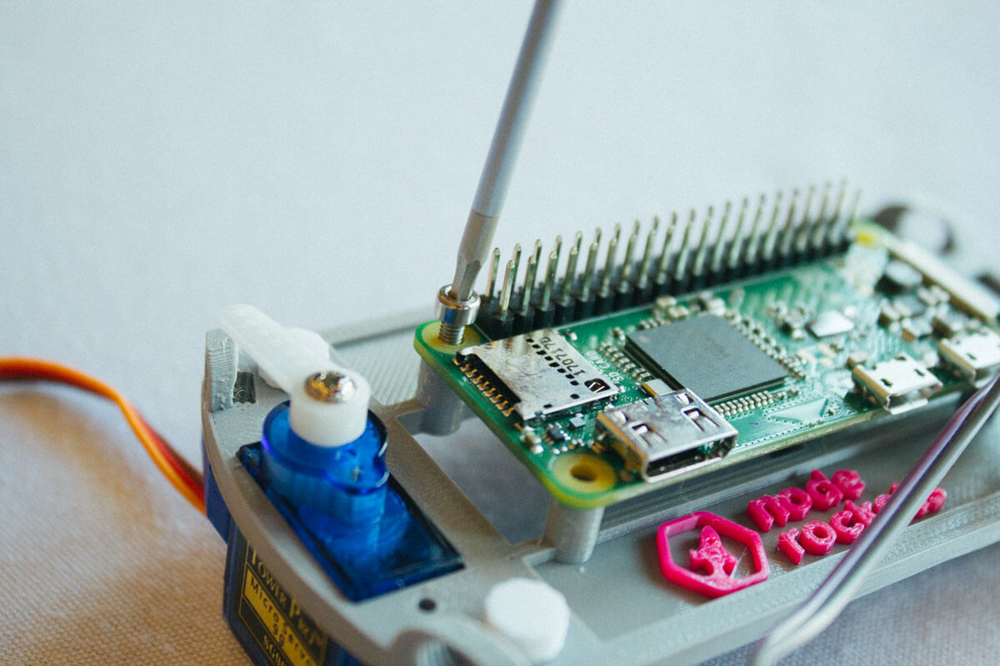
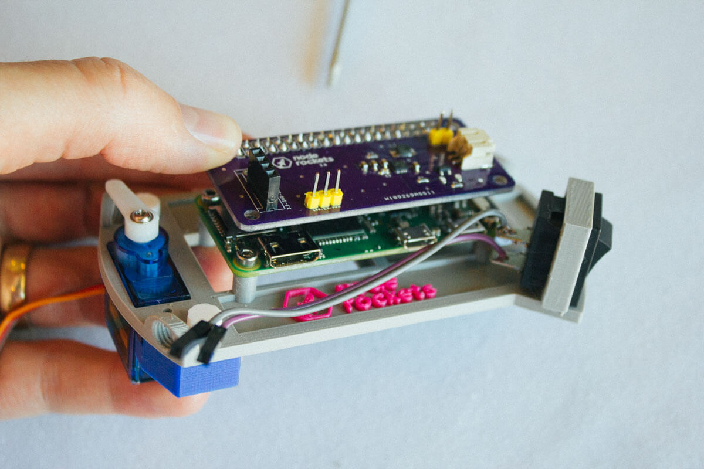
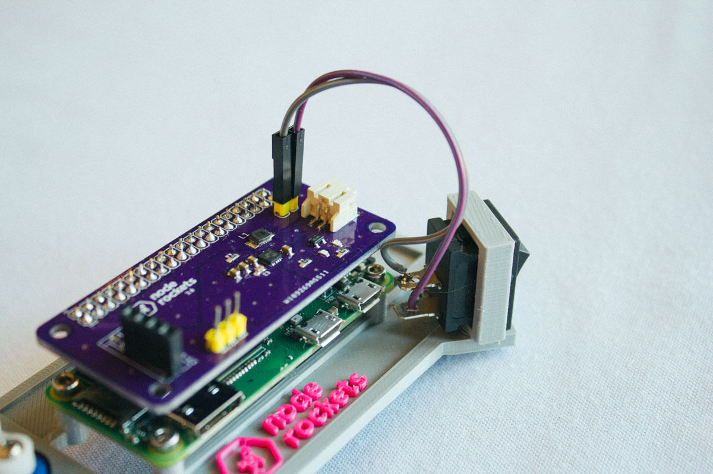
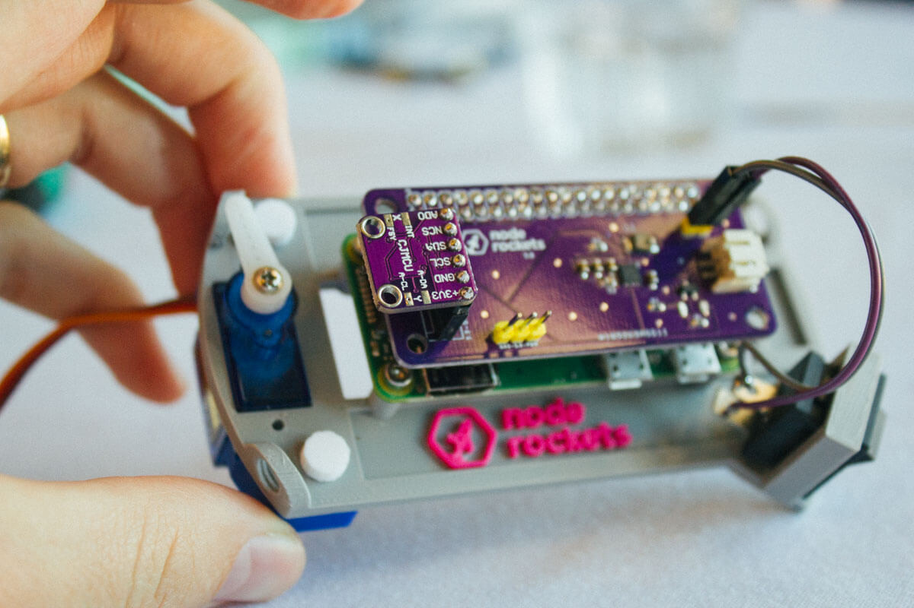
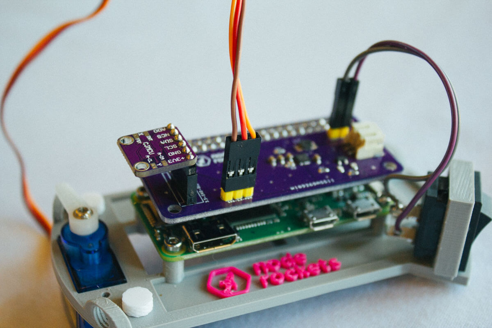
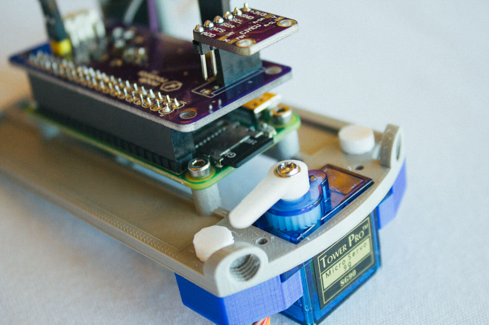

import "./styles.styl";

# Electronics

## What's Included

- Pre-flashed Micro-SD card
- Raspberry Pi
- Shield
- Battery
- Sled (Plastic Base that holds everything)
- 4 Metal Screws (to secure Pi to sled)
- 3 wide plastc screws
- 2 thinner plastic screws
- 1 Servo Kit

# Assembly

### Insert Switch into Sled

### Mount Servo

Insert Servo into sled. After you get it all assembled, you'll need attach the servo arm with the screw. You'll need the pi running so you can know which direction to put it on. The arm should be facing parallel with the sled (plastic holder for electronics) and then it will swing perpendicular when activated.

### Secure Servo with Mount

Then attach servo holder with 2 longer plastic screws.

### Mount Raspberry Pi

Mount the Raspberry Pi to sled with 4 metal screws.

### Mount shield onto Pi

Align the headers from the shield with pi and firmly press the shield down.

### Connect Switch to Shield

Order doesn't matter since it's a switch.

### Mount Sensor Module

Make sure the `+3V3` lines up with the `3.3` on the shield.

### Connect Servo to Shield

Brown wire is `GND`(ground). Orange is `PWM`.

### Insert MicroSD Card

The card is already flashed with the node rockets server and drivers. [Here are instructions](https://github.com/noderockets/rocket/blob/master/instructions/sd-card.md) if you want to flash your own.

### Connect Battery

The Pi will start up, connect to the `NodeRockets` wifi and run a node server when it boots. Find the number on the MicroSD card case. Connect your computer to the `NodeRockets` wifi and go to `http://10.0.0.${SDCardNumber}`. You should see a dashboard with a graph and a rocket.

Ok, you're done. Move on to [building the rocket](/js-conf/rocket).
