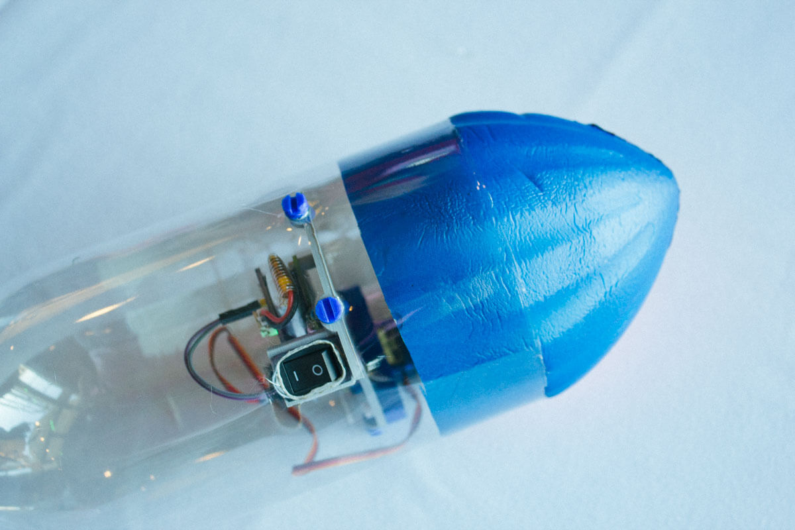
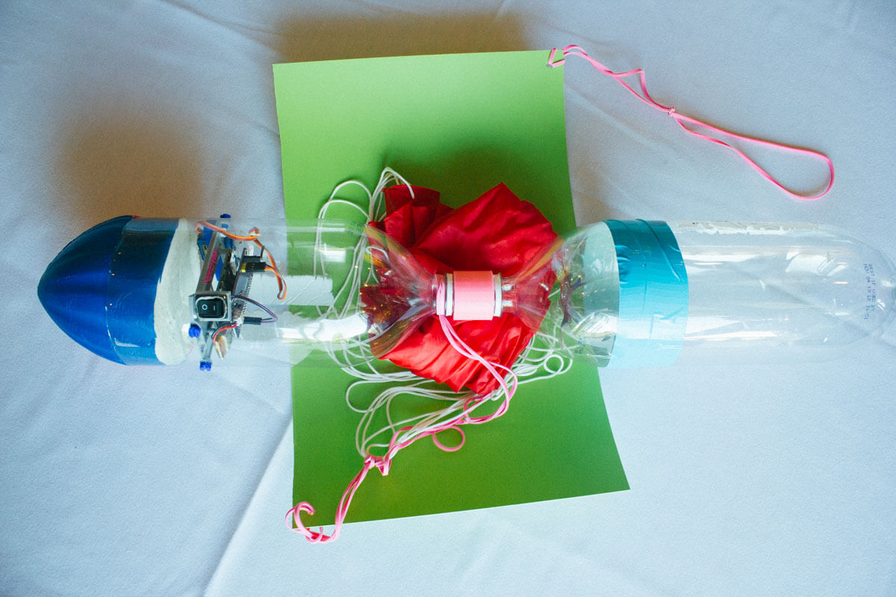

import "./styles.styl";

# Rocket

You will recieve a kit that looks like this.

## What's Included

- Half of a Nerf Ball
- 3 2 Liter Bottles
- 2 Liter Bottle Coupler
- Parachute
- Plastic Sheet
- Foam Sheet
- 4 Rubberbands

# Assembly

## Empty 2 Liter Sodas

First thing, you'll empty the 2 liters of soda however you desire. We recommend pouring them down the drain, but if you can down it. Go for it. 😊

Remove the labels for better aerodynamics.

## Cut the bottom off one bottle

Take one of the bottles and cut the very bottom off.

## Cut the top off another bottle

Take a different bottles and cut the very top off.

You should have 3 bottles like this:

## Tape the Bottles

Tape the top piece you cut off to the bottom of the full bottle you have. Try to align it as straight as you can.

## Couple Bottles

Connect the bottles with the coupler like this:

## Measure for Sled Mount

Place the assembled sled into the bottle with the open bottom. You'll want it about 2 inches from the cut bottom for best rocket performance.

## Measure for Sled Mount

Hold the sled in place and mark all the screw mounts and switch with a sharpie. Draw a line where the servo arm is so it can extend outside of the bottle.

## Make Holes with Soldering Iron

Take the soldering iron and make holes in the bottle for the 4 plastic screws. Then the switch. Then the servo arm.

## Mount Sled

Mount the sled inside the bottle with the new holes created. Use the wider, shorter plastic screws.

## Nerf Ball

Squeeze the cut-in-half nerf ball into the bottom of the cut bottle.

## Parachute

Lay the parachute out and stretch and align all the strings. Then attach a rubber band to it.

Attach 3 rubber bands like above.

## Parachute Sheet

Take the plastic sheet and solder a hole in it opposite corners about the diameter of a pencil. Attach one rubber band to one end and 3 chained rubber bands to the other. Take the one rubber band end and attach it to the end of the parachute strings.

## Wrap Parachute

Fold the parachute and strings accordian style and place on plastic sheet. Then wrap up the sheet around the rocket. Then wrap the rubber bands around the rocket. Tight at first and then looser once it gets up to the top. Attach a paperclip to the end of the rubber band. Slip the paperclip over the servo. When the servo actuates, the paperclip will slip off and deploy the parachute.

## Fins

Fins are pretty important for stability in flight. Cut them out of the foam. Lower profile might be better. You can use the measuring tape to mark the bottle so they are equidistant around the bottle.

## Finish

Take a look at your sick finished rocket.

