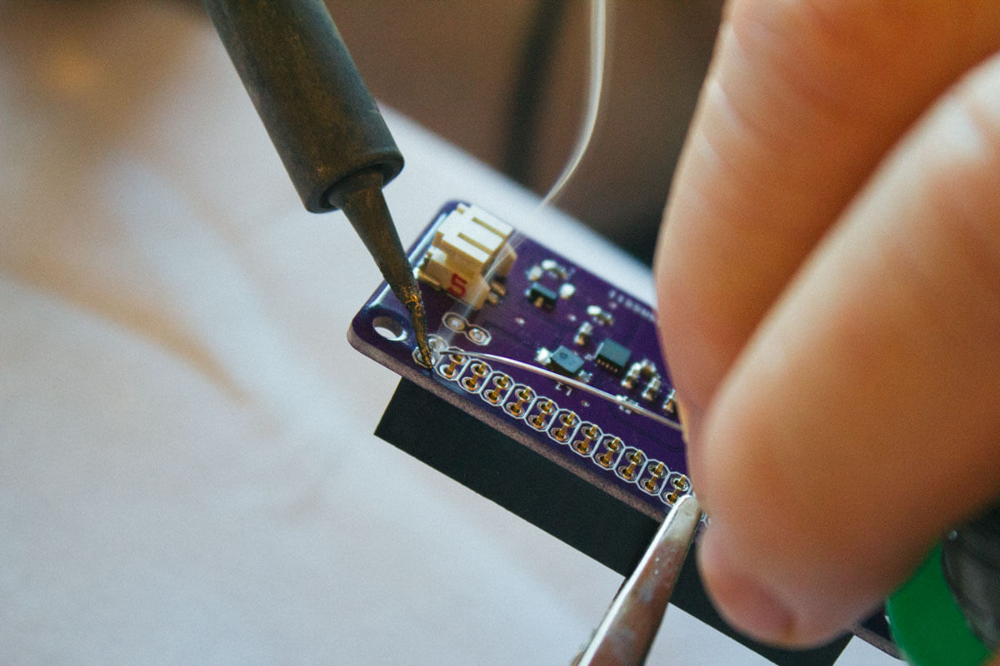

import './styles.styl'

# Shield

The shield is the custom purple circuit board with the node rockets logo on it. If you picked a packet with a pre-soldered board, you can skip these steps and move on the [assembling the electronics](/js-conf/electronics).

## What's Included

- Dual Row Header
- Single Row Header
- 2 Header
- 3 Header
- Sensor module

# Assembly

### Step 1

Solder the set of 20 pin headers onto the bottom of the board so the pins come up through the top.

### Step 2

Solder the 2 pin headers onto the top of the board. This will be used for power.

### Step 3

Solder the 3 pin headers onto the top of the board. This will connect to the servo.

### Step 4

Solder the 4 pin headers onto the top of the board in the 6 holes. Align it furthest away from the 20 pin headers. This will connect to the sensor module.

### Step 5

Lastly, solder the wires to the switch.

Ok, you're done. Move on to [assembling the electronics](/js-conf/electronics).
